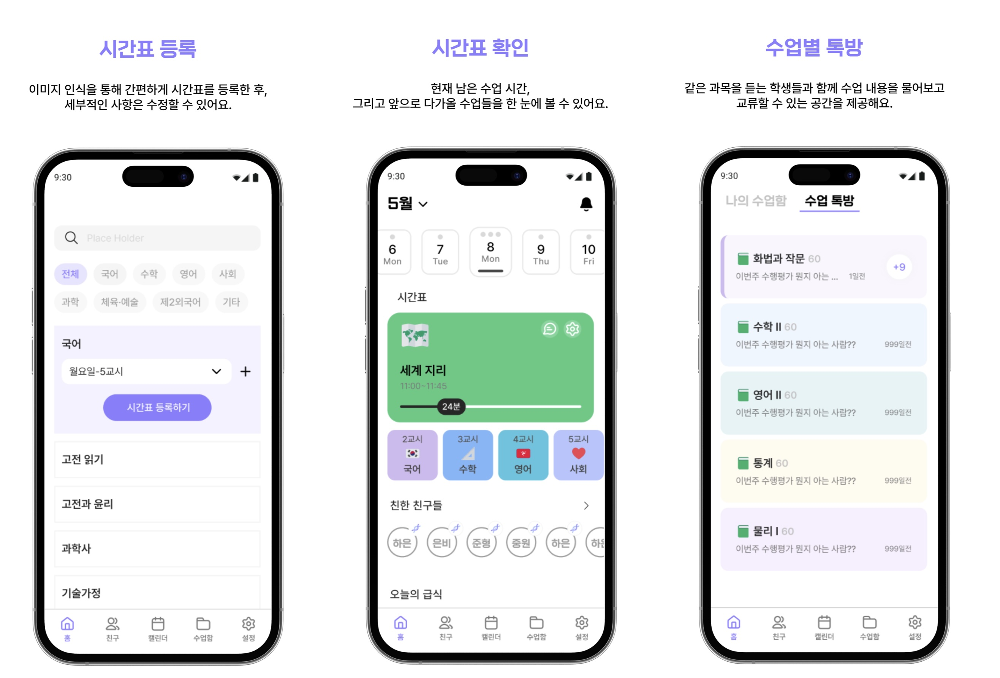
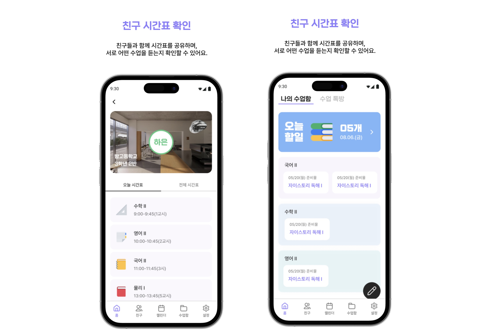
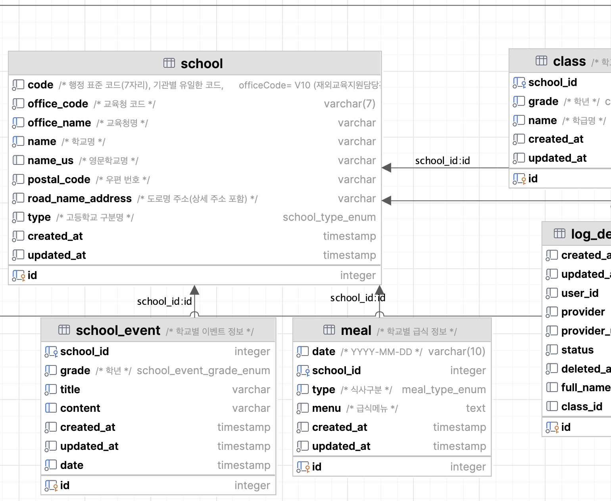

## BAAM
고교학점제 반영 커뮤니티 앱

#### 개요
- 기간: 2024-06 ~ 2024-11
- **원본 프로젝트:** 
  - 백엔드: [project-baam/baam-server](https://github.com/project-baam/baam-server.git)
  - 프론트엔드: [project-baam/frontend](https://github.com/project-baam/frontend.git)

#### 서비스 소개
<div align="center">


</div>


##### 주요 기능
1. 학교 정보 및 시간표 관리
- NEIS Open API 연동을 통한 학교 정보, 학급 정보 조회
- 2015 및 2022 개정 교육과정 과목 데이터 DB화
- 공지사항, 급식 데이터 조회

2. 과목별 채팅
- 분반별 자동 참여: 시간표에 등록된 과목 기반 채팅방 자동 참여
- 학급 단톡방: 학급 기준 채팅방 자동 생성 및 참여
- 채팅 메시지 암호화, 모든 사용자가 읽는 즉시 서버에서 삭제

3. 친구 관리
- 같은 학교 학생 검색 및 친구 요청
- 친구 시간표 확인 및 현재 수업 상태 표시
- 초성별 친구 목록 필터링

4. 알림 관리 & 푸시 알림
- 푸시 알림: 예약 일정, 친구 요청 수락/거절 알림
  
5. 개인/학급/학교 일정, 메모


#### 기술 스택
##### 프론트엔드
- React Native

##### 백엔드
- TypeScript / NestJS
- PosgreSQL / TypeORM
- Socket.io(WebSocket)
- Redis
- FCM(Firebase Cloud Messaging)

##### 인프라
- Digital Ocean
  - Droplet (VM)
  - Spaces Object Storage
  - Databases: Redis
- Supabase: PostgreSQL


### 헥사고날 아키텍처 도입
- 헥사고날 아키텍처 첫 시도로 실험적 적용  
- 완전한 구조가 아닌 기본 개념만 도입

### 도입한 것
- 포트(추상 Repository 인터페이스)와 어댑터(구현) 분리
  - 모듈 구조
```
module/
├── domain/          # 순수 도메인 정의
├── application/     # 유즈케이스, 포트 정의
└── adapter/         
    ├── persistence/ # 영속성 어댑터
    ├── presenter/   # REST/WebSocket 어댑터
    └── external/    # 외부 서비스 어댑터
```


#### 포트 추상화
비즈니스 로직이 구체적인 구현체가 아닌 추상 인터페이스에 의존하도록 설계:

```Typescript
// Port (추상화)
export abstract class SchoolRepository {
  abstract findByIdOrFail(id: number): Promise<SchoolEntity>;
  abstract upsertMany(schools: Partial<SchoolEntity>[]): Promise<void>;
}

// Adapter (구현체)
export class OrmSchoolRepository implements SchoolRepository {
  constructor(
    @InjectRepository(SchoolEntity)
    private readonly schoolRepository: Repository<SchoolEntity>,
  ) {}
}
```

#### 공통 예외 처리 시스템
- 도메인 레벨 통합 에러
  ```typescript
  export class ApplicationException extends Error {
    code: ErrorCode;
    getStatus(): HttpStatus {
      return CodeToStatus[this.code];
    }
  }
  export class ContentNotFoundError extends ApplicationException {
    constructor(resource: string = '$resource', id: string | number = '$id') {
      const message = `${resource} #${id} not found`;
      super(ErrorCode.ContentNotFound, message);
    }
  }
  ```
  ```typescript
  // 어댑터와 관계없이(REST API, WebSocket, GraphQL..) 동일한 도메인 예외 사용
  throw new ContentNotFoundError('Room', roomId);
  ```
   ➡️ 도메인 로직에서는 RET API나 WebSocket등 어떤 인터페이스를 통해 전달되는지 신경쓰지 않음
   ➡️ 각 어댑터에 연결된 예외 필터가 알맞은 형식으로 변환

- 프레젠터 계층별 커스텀 데코레이터와 예외필터 연결
    - `@RestApi` - `RestExceptionFilter`
    - `@AppWebSocketGateway` - `WebsocketExceptionFilter`
    ```typescript
    // 커스텀 데코레이터
    export function RestApi(): MethodDecorator & ClassDecorator;
    export function RestApi(prefix: string | string[],): MethodDecorator & ClassDecorator;
    export function RestApi(options: ControllerOptions): MethodDecorator & ClassDecorator;
    export function RestApi(param?: string | string[] | ControllerOptions) {
    const decorators: (MethodDecorator | ClassDecorator)[] = [
      UseFilters([InternalServerErrorFilter,RestExceptionFilter, // <--
      ParameterValidationExceptionFilter]),
      ];
    // ...

    // 커스텀 예외 필터
    @Catch(ApplicationException)
    export class RestExceptionFilter<T extends ApplicationException> implements ExceptionFilter
    {
      catch(exception: T, host: ArgumentsHost) {
        const response = host.switchToHttp().getResponse<Response>();
        response.status(exception.getStatus()).json({
          code: exception.code,
          message: exception.message,
        });
      }
    }
    ```

#### 커스텀 데코레이터로 관심사 분리
```typescript
@RestApi('school-dataset')  // 에러 필터 자동 적용
@Auth(AuthType.None)         // 인증 관련 처리
export class SchoolDatasetController {
  // 컨트롤러는 HTTP 관심사만 처리
}
```

---


### 고려하지 못한 것
1. Mapper 역할
   - mapper 를 사용하긴 했지만, 단순히 변환 로직으로 중복을 줄이는 역할만 수행
2. 데이터만 가지고 있는 도메인 모델
   - DTO와 큰 차이가 없는 도메인 모델
   - 데이터만 있고 행위가 없는 형태

#### ERD
클릭시 전체 이미지
<div align="center">
<a href="./erd.png" target="_blank">
  
</a>
</div>


